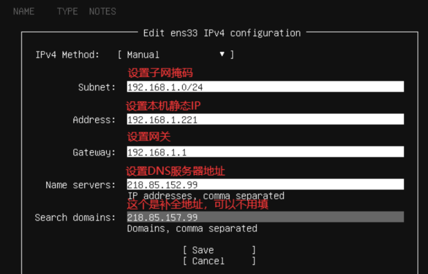
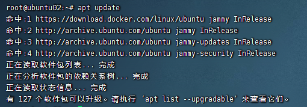

笔记基于Ubuntu-live-server-22.04记录

## 系统信息查看

### 发行版信息

```shell
$ lsb_release -a
No LSB modules are available.
Distributor ID: Ubuntu
Description:    Ubuntu 22.04.2 LTS
Release:        22.04
Codename:       jammy
```

### 硬件信息

> CPU型号核心数

```shell
$ lscpu
架构：                   x86_64
  CPU 运行模式：         32-bit, 64-bit
  Address sizes:         46 bits physical, 48 bits virtual
  字节序：               Little Endian
CPU:                     4
  在线 CPU 列表：        0-3
厂商 ID：                GenuineIntel
  型号名称：             Intel(R) Xeon(R) CPU E5-2680 v4 @ 2.40GHz
    CPU 系列：           6
    型号：               79
    每个核的线程数：     1
    每个座的核数：       4
    ......
```

> 内存信息

其中`manufacturer`代表厂商，`part number`代表型号规格，`speed`代表频率和速度

```shell
$ dmidecode -t memory
# dmidecode 3.3
Getting SMBIOS data from sysfs.
SMBIOS 2.8 present.

Handle 0x1000, DMI type 16, 23 bytes
Physical Memory Array
	Location: Other
	Use: System Memory
	Error Correction Type: Multi-bit ECC
	Maximum Capacity: 4 GB
	Error Information Handle: Not Provided
	Number Of Devices: 1

Handle 0x1100, DMI type 17, 40 bytes
Memory Device
	Array Handle: 0x1000
	......
```


## 资源使用情况

### CPU内存占用情况

CPU内存使用情况可以通过`top`命令查看，也可以使用增强版的`htop`命令，`top`命令是系统自带的，`htop`命令可能需要额外安装

```shell
# 安装htop命令
$ sudo apt install htop
```


### 查看实时网速

查看实时网速需要使用`ifstat`命令，直接输入即可，如果命令不存在可以apt安装

```shell
# 安装ifstat命令
$ sudo apt install -y ifstat

# 直接使用ifstat就可以查看网速，但是一般建议搭配参数使用，效果更好
$ ifstat -S -i eth0 -t 1

# 这里对常用参数进行介绍
-S    # 默认打印网速是一行一行打印的，很快铺满屏幕，-S后只会在一行内来回刷新
-i    # 默认打印所有网卡的网速信息，如果只想看eth0网卡的网速信息就使用 -i
-t    # 默认网速是每秒钟更新一次，可以使用-t指定更新频率
```


### 磁盘使用情况

TODO 内容待补充


## 网络相关配置

> 新装系统时配置IP的界面




> 修改IP地址

编辑`/etc/netplan/*.yaml`文件，按照下面的解释进行修改

```yaml
# This is the network config written by 'subiquity'
network:
  ethernets:
    # 网卡名称
    enp0s3:
      # 是否启用DHCP
      dhcp4: no
      # IP地址以及子网掩码，/24代表子网掩码前三位255
      addresses:
      - 192.168.1.10/24
      # 网关
      gateway4: 192.168.1.1
      # DNS服务器，可配置网关IP地址，同网关使用相同的DNS
      nameservers:
        addresses:
        - 192.168.1.1
        search: []
  version: 2
```

网卡配置文件编辑完成后，输入以下命令使配置生效

```shell
$ sudo netplan apply
```


> 修改hostname

```shell
$ vim /etc/hostname
```


## 设置时区为亚洲上海

```shell
# 查看当前系统时间
$ date
2023年 07月 11日 星期二 06:01:15 UTC

# 查看日期时间设置，发现是TimeZone时区是UTC时间
$ timedatectl
               Local time: 二 2023-07-11 06:01:25 UTC
           Universal time: 二 2023-07-11 06:01:25 UTC
                 RTC time: 二 2023-07-11 06:01:25
                Time zone: Etc/UTC (UTC, +0000)
System clock synchronized: yes
              NTP service: active
          RTC in local TZ: no

# 设置时区为亚洲上海
$ timedatectl set-timezone Asia/Shanghai

# 查看当前系统时间
$ date
2023年 07月 11日 星期二 14:01:40 CST
```

时区文件在`/usr/share/zoneinfo/Asia/Shanghai`，如果是Docker容器配置时区请看Docker笔记


## 设置系统语言为中文

> 效果图



```shell
# 首先使用该命令查看系统支持的语言
$ locale -a

# 如果不支持zh_CN的话说明缺少语言包，执行该命令安装语言包
# 安装完成后在执行上述命令就可以看到zh_CN了
$ apt install -y language-pack-zh-hans

# 编辑配置文件，将默认语言设置为zh_CN
$ vim /etc/default/locale

LANG="zh_CN.UTF-8"
LANGUAGE="zh_CN:zh"
LC_ALL="zh_CN.UTF-8"

# 之后重启系统即可
$ reboot
```


## 包管理器

### APT包管理器

`apt`是 Ubuntu 中的包管理器。它是 Advanced Packaging Tool 的缩写，可以在 Ubuntu 中搜索、安装、更新和卸载软件包

```shell
# 更新源地址的软件包列表
$ apt update

# 对系统中已安装的软件包进行更新
$ apt upgrade 

# 搜索软件包
$ apt search [package]

# 下载软件包为deb
$ apt download [package] 

# 下载并安装软件包
$ apt install [package]

# 显示软件包信息，包括软件包的描述、版本、大小等等
$ apt show [package]

# 清理所有已安装软件的缓存
$ apt clean

# 删除软件包，但会保留相关配置信息
$ apt remove [package]

# 删除系统中已安装但不被需要的软件包
$ apt autoremove

# 删除软件包，同时删除相关配置信息
$ apt purge [package]
```


### DOKG包管理器

`dpkg`是 Debian 系统中的低级软件包管理器，可直接管理 `.deb` 格式的软件包。`dpkg` 不会自动解决软件包依赖关系，因此在安装软件包之前需要手动解决依赖关系

`dpkg`通常用于在没有网络连接的情况配合`apt`下手动安装、升级或卸载单个软件包

```shell
# 安装deb包
$ dpkg -i package.deb

# 删除deb包
$ dpkg -r package

# 很少会用到不记那么多.....
```


### 关闭APT安装检查

当执行`apt install xxx`之后总会显示该信息影响操作

```shell
Scanning processes...
Scanning processor microcode...
Scanning linux images...
Running kernel seems to be up-to-date.
```

这是`needrestart`软件包提供的检查，它负责在你安装应用后检查并询问你是否重启受到影响的几个服务，是个很实用的功能，想要关闭功能可以直接简单粗暴的删除该软件包，后续有需要也可以使用`install`命令装回来

```shell
$ apt purge needrestart
```

也可以在不删除软件包的前提下修改配置文件，关闭检查

```shell
$ vim /etc/needrestart/needrestart.conf

找到下面这段内容，删除前面的注释符号并保存
#$nrconf{ucodehints} = 0;
```


## 防火墙常用命令

防火墙一般是系统自带的功能，如果由于某些情况导致系统没有防火墙，可以执行下面这段命令安装防火墙

```shell
$ apt-get install ufw
```

防火墙启动命令

```shell
# 启用防火墙
$ ufw enable

# 禁用防火墙
$ ufw disable

# 查看防火墙运行状态
$ ufw status
```

防火墙常用操作

```shell
# 新增开放22端口的规则，也可以使用ufw allow ssh命令达到同样的效果
$ ufw allow 22

# 新增关闭9000端口的规则
$ ufw deny 9000

# 删除开放9000端口的规则
$ ufw delete allow 9000

# 重新加载防火墙配置
$ ufw reload

# 重置防火墙规则
$ ufw reset
```

