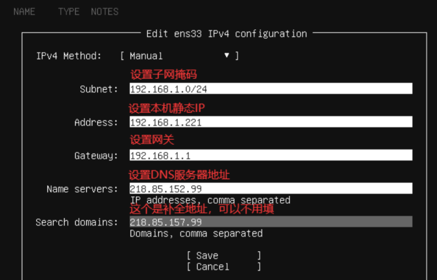

## 安装系统时配置IP地址




## 查看系统信息

> 查看系统发行版信息

```shell
$ lsb_release -a
No LSB modules are available.
Distributor ID: Ubuntu
Description:    Ubuntu 22.04.2 LTS
Release:        22.04
Codename:       jammy
```


## 设置时区为亚洲上海

```shell
# 查看当前系统时间
$ date
2023年 07月 11日 星期二 06:01:15 UTC

# 查看日期时间设置，发现是TimeZone时区是UTC时间
$ timedatectl
               Local time: 二 2023-07-11 06:01:25 UTC
           Universal time: 二 2023-07-11 06:01:25 UTC
                 RTC time: 二 2023-07-11 06:01:25
                Time zone: Etc/UTC (UTC, +0000)
System clock synchronized: yes
              NTP service: active
          RTC in local TZ: no

# 设置时区为亚洲上海
$ timedatectl set-timezone Asia/Shanghai

# 查看当前系统时间
$ date
2023年 07月 11日 星期二 14:01:40 CST
```

时区文件在`/usr/share/zoneinfo/Asia/Shanghai`，如果是Docker容器配置时区请看Docker笔记


## 设置系统语言为中文

> 效果图


```shell
# 首先使用该命令查看系统支持的语言
$ locale -a

# 如果不支持zh_CN的话说明缺少语言包，执行该命令安装语言包
# 安装完成后在执行上述命令就可以看到zh_CN了
$ apt install -y language-pack-zh-hans

# 编辑配置文件，将默认语言设置为zh_CN
$ vim /etc/default/locale

LANG="zh_CN.UTF-8"
LANGUAGE="zh_CN:zh"
LC_ALL="zh_CN.UTF-8"

# 之后重启系统即可
$ reboot
```


## 修改IP地址

编辑`/etc/netplan/*.yaml`文件，按照下面的解释进行修改

```yaml
# This is the network config written by 'subiquity'
network:
  ethernets:
    # 网卡名称
    enp0s3:
      # 是否启用DHCP
      dhcp4: no
      # IP地址以及子网掩码，/24代表子网掩码前三位255
      addresses:
      - 192.168.1.10/24
      # 网关
      gateway4: 192.168.1.1
      # DNS服务器，可配置网关IP地址，同网关使用相同的DNS
      nameservers:
        addresses:
        - 192.168.1.1
        search: []
  version: 2
```

网卡配置文件编辑完成后，输入以下命令使配置生效

```shell
$ sudo netplan apply
```


## 修改hostname

```shell
$ vim /etc/hostname
```


## 资源使用情况

### 内存和CPU

内存和CPU信息可以直接通过`top`命令查看，也可以使用增强的`htop`命令，`top`命令是系统自带的，如果想要使用`htop`命令可能需要额外安装

```shell
# 安装htop命令
$ sudo apt install htop
```


### 实时网速查看

查看实时网速需要使用`ifstat`命令，直接输入即可，如果命令不存在可以apt安装

```shell
# 安装ifstat命令
$ sudo apt install -y ifstat

# 直接使用ifstat就可以查看网速，但是一般建议搭配参数使用，效果更好
$ ifstat -S -i eth0 -t 1

# 这里对常用参数进行介绍
-S    # 默认打印网速是一行一行打印的，很快铺满屏幕，-S后只会在一行内来回刷新
-i    # 默认打印所有网卡的网速信息，如果只想看eth0网卡的网速信息就使用 -i
-t    # 默认网速是每秒钟更新一次，可以使用-t指定更新频率
```


### 磁盘使用情况

TODO


## 防火墙常用命令

防火墙一般是系统自带的功能，如果由于某些情况导致系统没有防火墙，可以执行下面这段命令安装防火墙

```shell
$ apt-get install ufw
```

防火墙启动命令

```shell
# 启用防火墙
$ ufw enable

# 禁用防火墙
$ ufw disable

# 查看防火墙运行状态
$ ufw status
```

防火墙常用操作

```shell
# 开放22端口，也可以使用ufw allow ssh命令达到同样的效果
$ ufw allow 22

# 关闭22端口的开放状态
$ ufw delete 22

# 重新加载防火墙配置
$ ufw reload

# 重置防火墙规则
$ ufw reset
```

