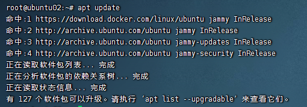

## 安装系统时配置IP地址


## 设置系统语言为中文

> 效果图



```shell
# 首先使用该命令查看系统支持的语言
$ locale -a

# 如果不支持zh_CN的话说明缺少语言包，执行该命令安装语言包
# 安装完成后在执行上述命令就可以看到zh_CN了
$ apt install -y language-pack-zh-hans

# 编辑配置文件，将默认语言设置为zh_CN
$ vim /etc/default/locale

LANG="zh_CN.UTF-8"
LANGUAGE="zh_CN:zh"
LC_ALL="zh_CN.UTF-8"

# 之后重启系统即可
$ reboot
```


## 修改IP地址

编辑`/etc/netplan/*.yaml`文件，按照下面的解释进行修改

```yaml
# This is the network config written by 'subiquity'
network:
  ethernets:
    # 网卡名称
    enp0s3:
      # 是否启用DHCP
      dhcp4: no
      # IP地址以及子网掩码，/24代表子网掩码前三位255
      addresses:
      - 192.168.1.10/24
      # 网关
      gateway4: 192.168.1.1
      # DNS服务器，可配置网关IP地址，同网关使用相同的DNS
      nameservers:
        addresses:
        - 192.168.1.1
        search: []
  version: 2
```


## 修改hostname

```shell
$ vim /etc/hostname
```


## 防火墙常用命令

防火墙一般是系统自带的功能，如果由于某些情况导致系统没有防火墙，可以执行下面这段命令安装防火墙

```shell
$ apt-get install ufw
```

防火墙启动命令

```shell
# 启用防火墙
$ ufw enable

# 禁用防火墙
$ ufw disable

# 查看防火墙运行状态
$ ufw status
```

防火墙常用操作

```shell
# 开放22端口，也可以使用ufw allow ssh命令达到同样的效果
$ ufw allow 22

# 关闭22端口的开放状态
$ ufw delete 22

# 重新加载防火墙配置
$ ufw reload

# 重置防火墙规则
$ ufw reset
```

