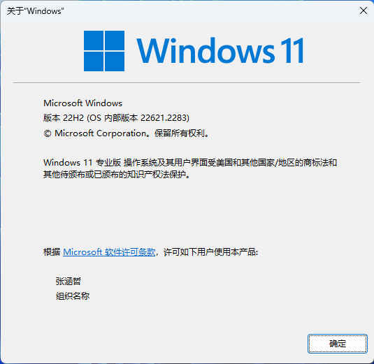

## 跳过首次开机设置OOBE

1. 在首次设置界面，同时按住Ctrl+shift+F3，系统自动重启后就会直接到桌面了
2. 解开超管账户，删除默认账户 — 重要！不解开超管无法进入系统
3. 如果每次开机会弹出`系统准备工具`，就打开命令行输入以下命令：

```shell
$ XCOPY %windir%\System32\svchost.exe %windir%\System32\oobe\audit.exe /X
```


## 查看系统信息

> 查看win版本信息

`Win + R`输入`winverA`查看系统版本信息




## 卸载自带应用

在PowerShell中选择执行以下命令

```shell
# 邮件和日历
$ Get-AppxPackage *communi* | Remove-AppxPackage

# 新闻
$ Get-AppxPackage *bing* | Remove-AppxPackage

# 人脉
$ Get-AppxPackage *people* | Remove-AppxPackage

# 照片
$ Get-AppxPackage *photo* | Remove-AppxPackage

# 纸牌游戏
$ Get-AppxPackage *solit* | Remove-AppxPackage

# 录音机
$ Get-AppxPackage *soundrec* | Remove-AppxPackage

# Xbox
$ Get-AppxPackage *xbox* | Remove-AppxPackage

# OneNote
$ Get-AppxPackage *OneNote* | Remove-AppxPackage

# 3D Builder
$ Get-AppxPackage *3d* | Remove-AppxPackage

# Camera相机
$ Get-AppxPackage *camera* | Remove-AppxPackage

# Groove音乐
$ Get-AppxPackage *zune* | Remove-AppxPackage
```


## 记录常用的脚本

### 递归删除文件夹

递归删除当前目录下的`.idea`和`target`文件夹

```shell
@echo off
setlocal

set "folder=%~dp0"

for /d /r "%folder%" %%a in (.idea, target) do (
    if exist "%%a" (
        echo Deleting "%%a"...
        rd /s /q "%%a"
    )
)

echo Done.
pause
```


### 递归重命名

递归当前目录，将`zh-CN`重命名为`zh-CN1`

```shell
@echo off
for /r "D:\Dev\Landmark\EDT\WellPlan" %%a in (zh-CN) do (
    if exist "%%a" (
        ren "%%a" "zh-CN1"
    )
)
pause
```

